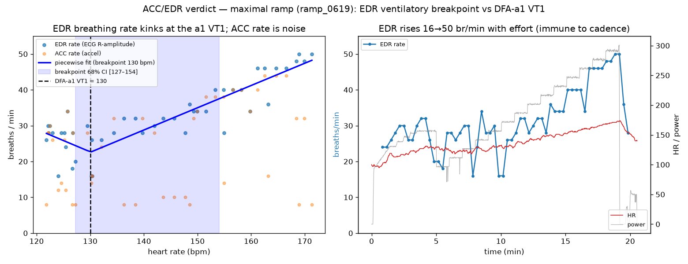
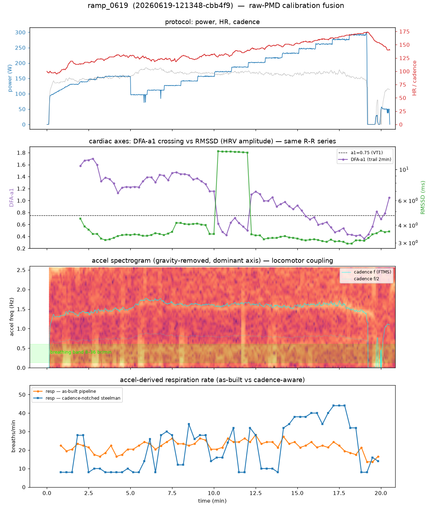

# Raw-PMD calibration fusion (Polar H10 ECG + ACC)

> **Public copy.** This is the developer's working writeup of the raw-Polar-PMD
> signal layer — what the strap captures, how it's decoded, which physiological
> axes it can yield, and whether any of them corroborate the DFA-a1 VT1
> calibration. It cross-references a few internal design documents
> (`calibrate-pivot`, `calibration-architecture`, `calibration-fusion-impl-spec`)
> that live with the application code and are **not** part of this public
> repository; those references are kept as provenance but aren't links you can
> follow here. The `scripts/…` and `ios/…` paths likewise point at the app repo.
> The bottom line — a recorded negative result — stands on its own below.

This documents the raw-Polar-PMD signal layer: what the H10 captures, how it's
decoded, which physiological axes it can yield, and whether any of them corroborate
the DFA-a1 VT1 calibration. Note the **raw ECG/ACC sidecars were withheld from the
published `datasets/dev-calibration-2026-06/` for privacy** (raw ECG is biometric —
see that README), so the PMD axes here are reproducible only from your own H10
capture; the committed session JSONs still reproduce the DFA-a1 baseline.

---

## Decision of record — 2026-06-21: calibration stays on R-R-derived DFA-a1; raw PMD is dropped from the product

**Decision.** Calibration uses **only the widely-available R-R-derived DFA-a1
crossing**. Raw Polar PMD (ECG + ACC) capture is **off by default** (`PmdManager.enabled`
→ `false`) and is now a developer/research tool, not a shipping dependency.

**Why — recorded so this isn't re-litigated:**

- This is **not** "PMD didn't work." The investigation below found a *genuinely
  promising* independent cross-check — EDR (ECG R-peak-amplitude respiration),
  whose ventilatory breakpoint matched the a1 VT1 on a maximal ramp (§4). The
  decision is that the **upside isn't worth the cost**, not that the signal is absent.
- **The cost is structural and lands on the rider.** A breakpoint cross-check needs
  data ~2 held rungs (≈ +40 W, tempo / Zone 3, ~8 min) **above** VT1; the a1
  crossing only needs to *reach* VT1 (a breakpoint needs both arms of the "V"; a
  crossing needs only to touch the threshold — see §6). That drags the gentle
  Zone-2 calibration into the zone the whole product exists to keep the rider out of.
- **The accessibility math is lopsided.** R-R comes from essentially any modern HR
  strap; raw PMD needs a Polar H10 specifically, exclusive BLE access to it,
  ~16 MB/h of capture, and offline decode — all to buy, at best, marginal precision
  on a band that is already biased *low* (so it's safe without it).
- **Net:** R-R is less restrictive (any strap), more accessible, quicker to
  calibrate (stop at the crossing — no Zone-3 overshoot), and simpler. **Trust the a1.**

**What this does NOT discard.** The learnings, the reproducible toolkit
(`scripts/pmd_fusion/`), the captured dataset (`datasets/dev-calibration-2026-06/`),
and the EDR result are all retained so this can be revisited **with evidence**, not
from scratch. The axis rankings in §0 and the on-ramp in §6 are kept as *"what we'd
build if we ever revisit,"* not a current build plan.

---

## 0. Verdict up front

The **only live calibration decision axis is the DFA-a1 = 0.75 crossing**
(`calibrate-pivot-2026-06.md` decision #4). Raw PMD's job is to **corroborate or
gate** that crossing — never to replace it, and (because the band is biased
*low*, so undershooting Zone 2 is cheap) never required for safety. Precision is
the only thing a raw axis can buy, so **the off-ramp — "not worth it, ship a1" —
is a first-class outcome.**

What the captured calibration dataset actually says (§4), ranked:

| Raw-PMD axis | Verdict | Why |
|---|---|---|
| **ECG → R-R audit** | **BUILD FIRST** (gate-only) | ECG-derived R-R reproduces the strap's onboard R-R to ~13 ms IQR → independently confirms the beats feeding a1, catching dropped/ectopic beats. Cheap, can't hurt. |
| **ECG → EDR ventilatory breakpoint** (R-peak *amplitude*) | **CANDIDATE — promote after replication** | Locomotor-immune; reaches ~50 br/min at max (corr +0.8 w/ HR); on the maximal ramp its breakpoint (HR 130) is **concordant with the a1 VT1 (130)**. But N=1 — needs multi-session, wide-range validation. |
| **ACC → respiration rate** | **REJECTED for VT1** | Pedaling swamps the breathing band above VT1 (cadence energy 1%→38% as HR 100→170). The as-built pipeline can't even see exercise breathing. |
| **ACC → tidal-amplitude proxy + ACC↔EDR trust gate** | **SUPPORT only** | Amplitude breakpoint is weak/non-robust; ACC's real use is confirming EDR (agreement ⇒ real breathing) and explaining artifact windows. |
| **RSA / frequency-EDR (respiration-from-R-R)** | **NO VALUE** | Not independent of a1; collapses at exercise HR. Confirmed: RMSSD saturates below VT1, no knee at the crossing. |

The strategic reframe: the project's long-standing "ACC respiration = the second
ventilatory axis" ambition should **pivot to "EDR = the second ventilatory
axis."** The accelerometer is the wrong sensor for a ventilatory threshold during
cycling; the ECG is not.

---

## 1. Capture format (what's recorded, where)

*(absorbed from `ios-capture-expansion-spec.md` — still the iOS implementation authority)*

Two storage tiers, both isolated from the control loop (a capture write/disk
error must never touch the tick):

- **1 Hz session JSON** (`data/sessions/<id>.json`): positional sample rows. The
  raw `0x2A37` HR flags byte is **row index 9**; R-R intervals are index 7.
- **Per-ride raw PMD sidecar** (`<id>.pmd.jsonl`), one JSON object per BLE frame:
  `{t, type, seq, b64}` — `t` host arrival epoch, `type` ∈ {`header`,`ctrl`,`ecg`,
  `acc`}, `b64` the **verbatim** PMD notification (10-byte header + samples +
  device ns timestamp). `ride.pmd_file` points the session JSON at it. The
  `header` line carries `ecg.rate_hz`/`acc.rate_hz`.
- `Ride` additive keys: `kind`, `rider_weight_kg`, `strap_battery_pct`,
  `energy_kj`, `pmd_file`. Storage cost ≈ ECG 1.4 MB/h + ACC 4 MB/h raw.

ECG **130 Hz, 24-bit µV** single-lead. ACC **200 Hz, 16-bit, ±8 g** (peak ~3.8 g
observed on-device, no clipping — 200 Hz is deliberately oversampled so the
stream doubles as a torso-motion log).

## 2. Decode (raw → physical units, offline)

*(condensed here; the full wire byte-spec is **Appendix A**; `core/src/pmd.rs` is the source of truth)*

PMD service `FB005C80-…`, control `…81` (write+indicate), data `…82` (notify).
START (LE): ECG `02 00 00 01 82 00 01 01 0E 00`; ACC `02 02 00 01 C8 00 01 01 10
00 02 01 08 00` (2nd byte `0x00`=ECG / `0x02`=ACC; rate codes `0x19/32/64/C8` =
25/50/100/200 Hz). Frame: byte0 type (`0x00` ECG / `0x02` ACC), bytes[1..9] u64-LE
device-ns (last sample), byte9 = `0x80` delta-bit | low-7 width. ECG = 3-byte LE
signed µV. ACC type-1 = 3× int16-LE mg. Delta frames are LSB-first bit-packed.

Core API (conformance-tested, reused everywhere): `pmd::decode_ecg_frame` /
`decode_acc_frame` → `{ts_ns, delta, samples}`; Python `zone2.ftms.decode_*`;
Swift via ffi. Offline CSV: `scripts/decode_pmd.py`.

> ⚠️ **Alignment is the #1 hazard.** The sidecar is on the Polar **device clock**
> (~6×10¹⁷ ns); the session is Unix epoch. A naïve least-squares fit
> `epoch ≈ a·device_ns + b` for a ~1e-9 slope is catastrophically ill-conditioned
> — we measured a **600 s residual**, the same failure class as the ~85 s offset
> that once retracted an analysis of this dataset. **Center/scale the device clock
> to seconds-from-first-frame before fitting**, then **prove alignment physically**
> (ECG-derived HR vs strap HR must agree to ~1 bpm). `scripts/pmd_fusion/loaders.py`
> does both and refuses to emit fusion if the ECG-HR RMS exceeds 3 bpm.

## 3. The candidate axes (menu with verdicts)

### 3.1 ECG → reconstruct-our-own-R-R for the loop — REJECTED
The streamed ECG is 130 Hz (~7.7 ms fiducial grid) vs the strap's internal R-R at
1/1024 s ≈ 0.98 ms. Reconstructing R-R from 130 Hz is strictly coarser; don't feed
the loop from it. *(The audit use below is different — it's a cross-check, not a
replacement.)*

### 3.2 ECG → R-R AUDIT (quality gate) — BUILD FIRST  ·  implementation spec
The one live axis (DFA-a1) consumes the strap's onboard R-R, and trusts the
strap's *own* artifact filter (`corrected_fraction` in `hrv::analyze`). Raw ECG
gives a **second, independent** beat source to confirm it.

**Empirical basis (§4):** ECG-derived R-R matched strap R-R to **median −0.1 ms,
IQR 12.7 ms, 100 % beat match** — essentially the 7.7 ms ECG quantization. So the
ECG can verify the R-R stream beat-for-beat. (Caveat: on a healthy rider with good
contact there is little to catch — `corrected_fraction` ≈ 0. Its value is
*insurance for the bad day*: poor contact, ectopy, dropouts — exactly when a1
would silently mislead.)

**Spec.** A `FULL_RAW`-tier (raw-ECG present) consistency pass, offline /
post-ride, gate-only — it never changes a VT1 number, only the confidence on it.

- New `core/src/ecg.rs` (no R-peak detector exists in the core today):
  `fn rpeaks(ecg_uv: &[f32], fs: f64) -> Vec<usize>` (bandpass 5–25 Hz → derivative
  → square → moving-window integrate → refractory peak-pick, refine to local |QRS|
  max). Pure, I/O-free, unit-tested against a captured frame set the way `pmd.rs`
  is. Reference impl: `scripts/pmd_fusion/signals.py::ecg_rpeaks`.
- `fn rr_audit(ecg_uv, fs, strap_rr_ms: &[(f64 t, f64 rr)]) -> RrAudit` →
  `{ matched_frac, median_dev_ms, iqr_ms, n_ecg_only, n_strap_only }`. Match each
  strap beat to the nearest ECG-R-R within 0.6 s; large `n_ecg_only`/`n_strap_only`
  or a fat IQR ⇒ the strap R-R for that window is suspect.
- Wire into the step-test report: a per-rung `rr_audit` lowers a rung's trust when
  ECG and strap disagree, *upstream of* the existing `trusted`/`corrected_fraction`
  gate that drives `bracket_trusted` → `band_status` (`session.rs:1281`,
  `:1326`, `BAND_CONFIRM_CI_BPM=5`). Net effect: a clean ECG audit lets a
  `provisional` read become `confirmed`; a failing audit blocks a false
  `confirmed`. **No new VT1 estimate — a veto on the existing one.**

### 3.3 ECG → EDR ventilatory breakpoint (R-peak amplitude) — CANDIDATE
R-peak **amplitude** is modulated by respiration (chest geometry vs lung volume).
Resample the per-beat R-amplitude to a 4 Hz grid, band-limit 0.1–0.9 Hz, take the
dominant spectral peak per window → breathing rate.

This is **amplitude-EDR, not the RSA/frequency-EDR** the H10 review (correctly)
says craters at exercise HR — amplitude-EDR does **not** depend on RSA and
survives to max effort (§4). It is the strongest result in the whole
investigation and is **independent of a1** (cardiac-*electrical*-mechanical, not
autonomic-fractal), so it can in principle *recenter* a1's known cycling bias —
the thing ACC respiration was supposed to do but can't.

Status: **`Validating`** — promising on one maximal ramp, unreplicated. Promotion
criteria in §6.

### 3.4 ECG morphology (longevity / arrhythmia) — REAL, non-VT1
A self-reviewed single-lead ECG strip (ectopy, arrhythmia Polar silently hides as
noise) is a genuine longevity benefit and the ground-truth instrument for
validating the artifact pipeline (look at the waveform around a flagged
`corrected_fraction` spike). Offline; not a calibration input.

### 3.5 ACC → respiration rate — REJECTED for VT1
The chest accelerometer is swamped by **locomotor-respiratory coupling**: the
pedal stroke injects energy into and around the breathing band, and it *grows*
with intensity — exactly where VT1 lives. The as-built pipeline
(`core/src/respiration.rs`) additionally can't see exercise breathing (its
difference-of-EMA passband tops out ~0.5 Hz = 30 br/min; refractory caps at 40;
whole-window PCA locks onto torso sway/cadence). Even a cadence-notched, wider-band
rebuild only recovers a coarse trend, never a VT1-precise breakpoint (§4).

### 3.6 ACC → tidal-amplitude proxy + ACC↔EDR trust gate — SUPPORT
Two salvageable roles, neither a standalone VT1 estimator: (a) breathing-band
amplitude as a weak tidal/ventilation-depth proxy; (b) **ACC↔EDR agreement** as a
trust gate — when the cadence-notched ACC rate agrees with EDR, the breathing read
is real; when they diverge (as on the non-crossing rides), distrust it. Plus the
always-valid use: a torso-motion log that explains *why* an R-R window went
`unusable` (out-of-saddle surge vs electrode lift).

### 3.7 RSA / frequency-EDR (respiration-from-R-R) — NO VALUE
Shares the R-R series, sensor, and artifacts with a1, so it can't narrow the
fusion CI, and it's unreliable at VT1 (RSA collapses). Confirmed empirically:
RMSSD collapses 13→3 ms and saturates *below* VT1 with no knee at the crossing.

---

## 4. Empirical findings (captured calibration dataset)

`calibrate-pivot` decision #4 earmarked a real raw-PMD VT1 calibration "as the
dataset to validate [the cross-check] against." This is that analysis. Five rides
carry full PMD; the load-bearing ones:

| ride | what | a1 VT1 | role |
|---|---|---|---|
| `…cbb4f9` | maximal ramp, HR 97→**171** | crossing ~130 | the only ride with the range to see a ventilatory breakpoint |
| `…5f4e54` | shipped Zone-2 calibration (180 W top) | crossing ~133 | operational protocol — stops too near VT1 to corroborate |
| `…cd58f7` | older step test | a1 never crossed | partial control |
| `…4cb065` | steady ride | no crossing | **negative control** |

**Alignment — validated.** After the centered-clock fix, ECG-derived HR matched
strap HR to **mean ~0.0, RMS ≈1 bpm, max |Δ| <3 bpm** on every ride. The time base
is trustworthy (a tens-of-seconds offset would scatter this wildly during a ramp).

**ECG→R-R audit — works (§3.2):** IQR 12.7 ms, 100 % beat match on the ramp.

**EDR ventilatory breakpoint — concordant with a1 on the maximal ramp:**
EDR rises 16→50 br/min over the ramp (corr **+0.84** with HR). A two-segment fit
puts its breakpoint at **HR 130** — equal to the a1 VT1 — and that breakpoint is
**stable across window sizes and bands (7/9 configs at 130, p<0.001)** and in
power terms at 161–172 W ≈ the a1 VT1 power. Two *independent* H10-derived signals
agreeing on VT1 to within a couple bpm is the strongest corroboration in the
dataset.



**ACC respiration — fails under load.** As-built: rate stuck 17–27 br/min, no
breakpoint, corr ≈ 0. Cadence-notched rebuild: corr +0.45 with HR but no robust
breakpoint on the clean ascending ramp. The spectrogram shows why — the cadence
band (cyan) brightens into a wall as the breathing band fades; cadence energy in
the breathing-axis projection climbs **1 % → 38 %** as HR goes 100→170.



**Negative controls behave.** EDR shows **no** breakpoint on the steady ride
(doesn't manufacture one); on the non-crossing rides the **ACC↔EDR agreement is
poor** (corr +0.03 / +0.23), correctly flagging those reads as untrustworthy.

**The honest limit: N=1.** The EDR↔a1 concordance rests on a single maximal ramp.
The operational Zone-2 calibration (`…5f4e54`) couldn't confirm it — its HR range
stops at VT1, so there's nothing above the knee to fit. **This is a protocol
implication, not just a sample-size caveat (see §6).**

---

## 5. The fusion / decision model

*(mechanics live in `calibration-fusion-impl-spec.md`; corrected here for the live core)*

**Independence is load-bearing.** Inverse-variance/agreement fusion only tightens
the CI when axes are *independent*. The genuinely independent VT1 axes are
mechanical (power-at-VT1) and ventilatory (EDR / ACC respiration); R-R-derived
respiration is not. EDR's independence from a1 is exactly what makes its §4
concordance meaningful.

**Gate, don't average.** The combiner is a state machine, not a weighted mean: per
stage classify Below / Boundary / Above against 0.75±`SIGMA_A1`; reconcile across
axes; refuse to average across disagreement (repeat the stage instead); emit a
bracket + confidence. A raw axis enters only once `Validated`, and even then it
**upgrades a marginal read, never gates** the a1 result.

> **Doc-drift correction (verified against `core/src/`):**
> `calibration-fusion-impl-spec.md` and `calibration-architecture.md` reference
> `POWER_CONCORDANCE_W`, `HR_CONCORDANCE_BPM`, and a `StepTestReport` carrying
> `concordant` / `prior_vt1`. **All four are removed from the core.** `band_status`
> is now read-quality off the a1 read alone: `usable` (`vt1_hr.is_some() &&
> bracket_trusted`) + CI ≤ `BAND_CONFIRM_CI_BPM` (5 bpm) ⇒ `confirmed`, else
> `provisional`, else `null` (`session.rs:1326`). The report still carries the
> dormant `vt2_*` fields.

## 6. The revisit on-ramp (PARKED — see "Decision of record")

> Per the decision of record, none of this is being built now; calibration stays
> on R-R-derived a1. This is the ordered on-ramp *if* raw PMD is ever
> reconsidered — kept so a future revisit starts from evidence, not a blank page.
> The lowest-cost, lowest-regret entry point is #1.

1. **The ECG→R-R audit (§3.2).** Cheapest win, hardens the one live axis,
   gate-only so it can't regress VT1. New `core/src/ecg.rs` + `rr_audit` into the
   step-test report.
2. **Promote EDR to a core estimator + capture to validate it.** Port
   `edr_rate_series` into `core/src/` (alongside `respiration.rs`), keep it
   `Validating`. Then the data work: it must clear a **pre-registered** bar before
   it influences any band —
   - breakpoint detectable with CI tighter than ±10 bpm, **reproduced across ≥3
     wide-range sessions on different days**;
   - breakpoint concordant with the a1 VT1 within the a1 CI;
   - **no** false breakpoint on steady/non-crossing controls;
   - features frozen before a held-out test; demonstrated to beat a1-alone.
   Miss the bar → **off-ramp: ship a1.** That's a legitimate landing, not a failure.
3. **Protocol change to enable corroboration.** A ventilatory breakpoint needs
   data *above* VT1. The shipped Zone-2 calibration stops at the crossing, so it
   can never corroborate. To use EDR, the calibration (or an occasional opt-in
   effort) must climb **~2 rungs past the expected VT1** — a deliberate tension
   with the "don't tire the rider" thesis to be resolved before committing.
4. **ACC stays a motion-log + trust-gate**, not a ventilatory estimator.

## 7. Sources & provenance

Dataset (the rides §4 analyzes): `datasets/dev-calibration-2026-06/` (+ its README
for provenance/sensitivity). Capture/decode: `core/src/pmd.rs`,
`scripts/decode_pmd.py`, `ios/Zone2/BLE/PmdManager.swift`. HRV/a1: `core/src/hrv.rs`,
`core/src/session.rs`. Respiration baseline: `core/src/respiration.rs`. Analysis +
figures: `scripts/pmd_fusion/`. Physiology & axis rationale:
`calibration-architecture.md` §2–4, `calibrate-pivot-2026-06.md`. Combiner
mechanics: `calibration-fusion-impl-spec.md`.

---

## Appendix A — PMD wire protocol (GATT / control-point / ACC frame byte-spec)

*Folded in verbatim from the (now-deleted) `pmd-accel-respiration.md` §1–4 + §6
on 2026-06-22. This is the reference-grade PMD byte-spec; `core/src/pmd.rs` is the
source of truth in code. The byte tables / hex / START sequences below are
preserved exactly. The accel-respiration *strategic* ambition that doc carried
(its §5) is dead — see §3.5/§4 above (locomotor coupling; the second-ventilatory
axis moved to EDR from the ECG), so it is intentionally NOT folded in.*

The PMD link, raw ECG+ACC capture, and the offline frame decoders described here
are implemented and validated on-device: iOS `PmdManager.swift` (shares the H10's
single CBPeripheral, subscribes the PMD service, writes START, dumps raw frames to
a `.pmd.jsonl` sidecar) and `core/src/pmd.rs` (raw+delta ECG/ACC decoders,
conformance-tested against real captured frames) + `scripts/decode_pmd.py`. ACC
runs at 200 Hz / ±8 g (chosen so hard efforts don't clip — validated, peak ~3.8 g
with no clipping). Capture is additive/offline — it never touches the control loop.

### A.1 GATT layout

PMD service is vendor-specific, 128-bit, Polar base UUID
`FB005C8x-02E7-F387-1CAD-8ACD2D8DF0C8`:

| Role | UUID | Properties |
|------|------|-----------|
| PMD **Service** | `FB005C80-02E7-F387-1CAD-8ACD2D8DF0C8` | — |
| PMD **Control Point** | `FB005C81-02E7-F387-1CAD-8ACD2D8DF0C8` | Read + Write + **Indicate** — write commands here; responses come back as indications; a plain Read returns the available-measurements bitmask |
| PMD **Data** (Data MTU) | `FB005C82-02E7-F387-1CAD-8ACD2D8DF0C8` | **Notify** — streaming measurement frames |

`...C81` = control/write, `...C82` = notify/data. HR stays on `0x180D`/`0x2A37`
(R-R already handled there). Subscribe to **both**: notifications on `...C82`,
indications on `...C81` (in CoreBluetooth `setNotifyValue(true:)` handles both).

### A.2 Control Point protocol

Requests are `[opcode][measurement_type][settings…]`.

- Opcodes: `GET=0x01`, `START=0x02`, `STOP=0x03`.
- Measurement type is an index: `ECG=0x00`, `PPG=0x01`, **`ACC=0x02`**, `PPI=0x03`,
  `GYRO=0x05`, `MAG=0x06`, `SDK=0x09`. The H10 supports ECG and ACC.
- List supported: plain **Read** of `...C81` → `0x0F <flags> …` (bit 2 ⇒ ACC).
- Query one measurement's settings: write `[0x01, 0x02]` (GET, ACC).

Settings TLV triples: `[setting_type][array_len][value…]`, value little-endian,
2 bytes except CHANNELS (1 byte). Setting types: `SAMPLE_RATE=0x00`,
`RESOLUTION=0x01`, `RANGE=0x02`, `CHANNELS=0x04`, `FACTOR=0x05`.

#### Concrete ACC START (verified byte-for-byte in two reference impls)

```
ACC_WRITE = [0x02, 0x02,  0x00,0x01,0xC8,0x00,  0x01,0x01,0x10,0x00,  0x02,0x01,0x08,0x00]
            START  ACC    SAMPLE_RATE=200Hz      RESOLUTION=16-bit      RANGE=±8g
```

- ⚠️ **Second byte must be `0x02` (ACC).** `0x00` is ECG — a common mis-read. ECG's
  start is `[0x02,0x00, 0x00,0x01,0x82,0x00, 0x01,0x01,0x0E,0x00]` (130 Hz, 14-bit).
- Sample rates: 25/50/100/200 Hz → `0x19/0x32/0x64/0xC8` (no native 52 Hz).
- Ranges: ±2/±4/±8 g → `0x02/0x04/0x08`. **The shipped capture uses ±8 g** — chosen
  so hard efforts don't clip (validated on-device, peak ~3.8 g, no clipping); the
  16-bit resolution leaves ample counts per g for chest-wall accelerations even at
  ±8 g. (25–50 Hz would suffice for ≤0.5 Hz breathing, but 200 Hz is shipped to
  double as a motion log.)
- Write **With Response**.

#### Control-point response

`[0xF0][op_code][measurement_type][error_code][more_frames?][settings…]`.
`error_code == 0x00` ⇒ success. Error codes: `0x01` invalid op, `0x02` invalid
measurement type, `0x03` not supported, `0x05` invalid parameter, `0x06` already in
state, `0x08` invalid sample rate, `0x09` invalid range, `0x0C` invalid state,
`0x0D` device in charger. (On iOS, bonding is not required; the Windows-only
"insufficient authentication 0x05" issue doesn't apply.)

### A.3 ACC data frame format

Notification on `...C82`: fixed 10-byte header + payload.

| Bytes | Field | Decode |
|-------|-------|--------|
| `[0]` | Measurement type | `0x02` = ACC |
| `[1..9]` | **Timestamp** | u64 little-endian **nanoseconds**, refers to the **last** sample in the frame. Polar epoch is 2000-01-01, not Unix — for breathing just diff it as a monotonic counter. |
| `[9]` | **Frame-type byte** | top bit `0x80` = delta/compressed; low 7 bits = type |
| `[10..]` | Samples | format per `[9]` |

Frame-type byte: `DELTA_BIT=0x80`, `TYPE_MASK=0x7F`. Types: `0→8-bit`, `1→16-bit`,
`2→24-bit` per axis, 3 channels (X,Y,Z). (`0x81` = delta + type 1, the source of the
infamous "RFU" confusion.)

#### Easy path — RAW frame (`data[9] == 0x01`), what the H10 actually sends

Payload from offset 10 is packed samples; type 1 = three int16 LE = 6 bytes/sample,
already in **milli-g**:

```python
for off in range(10, len(data), 6):
    x = int.from_bytes(data[off  :off+2], 'little', signed=True)
    y = int.from_bytes(data[off+2:off+4], 'little', signed=True)
    z = int.from_bytes(data[off+4:off+6], 'little', signed=True)   # mg
```

Per-sample timestamps: frame ts is the *last* sample; walk back by `1/fs` (0.005 s
@ 200 Hz).

#### Hard path — DELTA frame (top bit set)

Layout after offset 10: `[reference sample (full-res, one int/channel)]` then
repeating groups `[deltaBits(1B)][sampleCount(1B)][bit-packed deltas]`.

1. Reference: `channels` full-res LE signed ints (ACC: 3× int16 = 6 bytes),
   sign-extended to 32-bit.
2. Per group: `deltaBits` = bits per signed delta; `sampleCount` = samples (each =
   `channels` deltas); group payload = `ceil(sampleCount·deltaBits·channels/8)` bytes.
3. Bit unpacking — **LSB-first** within each byte, contiguous bit-stream, fields
   straddle byte boundaries unaligned. Read `deltaBits` bits LSB-first; sign-extend
   from arbitrary width: `mask = (~0) << (deltaBits-1); if value & mask: value |= mask`.
4. Channel order X,Y,Z; **accumulate** each delta onto the previous reconstructed
   sample (seeded by the reference).
5. Scale to mg via the device-reported `factor` (FACTOR setting, IEEE-754 float):
   `mg = round(sample · factor · 1000)`. (Raw path needs no factor — int16s are mg.)

### A.4 Reference implementations

- **`kieranabrennan/dont-hold-your-breath`** (the doc's citation) — Python/bleak.
  `PolarH10.py` does BLE + raw ACC parse; `BreathingAnalyser.py` does respiration:
  2nd-order Butterworth LP@0.04 Hz to isolate+subtract gravity → vector norm →
  LP@0.5 Hz → `find_peaks` (amplitude ≥ 0.02) → rate `60/Δt`, 3-sample smoothing.
- **`kieranabrennan/every-breath-you-take`** — successor; lighter, **causal** pipeline
  (project onto chest z-axis, EMA gravity, EMA smooth, descending zero-crossings) —
  better suited to a live iOS feed.
- **`polarofficial/polar-ble-sdk`** — authoritative wire spec, Kotlin:
  `BlePMDClient.kt` (delta unpacker), `PmdDataFrame.kt` (header/ts/frame-type/factor),
  `AccData.kt` (mg scaling). No markdown wire spec — byte format is in
  `technical_documentation/online_measurement.pdf` + the Kotlin source.
- **`fsmeraldi/bleakheart`** — cleanest readable Python: full control-point protocol,
  error table, raw ACC, and a commented delta decoder with a worked hex example.
- Also: `markspan/PolarBand2lsl` (confirms ACC_WRITE bytes), `MesmerPrism/PolarH10`
  (community markdown protocol docs), SDK issue #443 (the `0x81` frame-type thread).

### A.5 Swift / CoreBluetooth notes

- Control-point write **With Response** (`.withResponse`); the 14-byte command is
  well under MTU.
- Subscribe to the control point (indicate) **before** writing START so you catch the
  `0xF0…error_code` response; also subscribe to the data char (notify).
- Pass full 128-bit UUIDs to `CBUUID(string:)`; iOS won't expand vendor UUIDs.
- ACC frames are large (200+ bytes at 200 Hz) — CoreBluetooth negotiates MTU
  automatically; parse a loop from offset 10 to `data.count`, don't assume 20 bytes.
- 64-bit ns timestamp: fold bytes explicitly
  `(0..<8).reduce(UInt64(0)) { $0 | (UInt64(data[1+$1]) << (8*$1)) }`; treat as a
  monotonic counter (Polar epoch ≠ Unix).
- Delta sign-extend in Swift: build deltas in `Int32`,
  `let m = Int32(bitPattern: ~UInt32(0) << (deltaBits-1)); if v & m != 0 { v |= m }`.
- No bonding needed on iOS. Existing `ios/Zone2/BLE` (HeartRateManager) already does
  CoreBluetooth + native R-R; add a `PmdManager` (discover `FB005C80…`, grab the two
  chars, subscribe, write START, decode). Budget ~150–250 lines Swift for BLE +
  raw-ACC, +~50 for the delta path, +~100–150 for the breathing analysis port.

### A.6 Source provenance (PMD wire spec)

UUIDs / control point / ACC_WRITE / error codes: bleakheart `_core.py`,
kieranabrennan `PolarH10.py`, markspan `PolarBand2lsl`, MesmerPrism protocol docs.
ACC capabilities: official `documentation/products/PolarH10.md`. Frame header /
`0x80` delta bit / bit-packing / mg scaling: official SDK `BlePMDClient.kt` /
`PmdDataFrame.kt` / `AccData.kt`, cross-checked with bleakheart; SDK issue #443.
Wire-spec PDF: `technical_documentation/online_measurement.pdf`. Breathing:
`dont-hold-your-breath` / `every-breath-you-take`.

---

## Appendix B — Within-session durability alarms (HR:power decoupling) + battery / RMSSD readiness

*Folded in from the (now-deleted) `h10-hr-signal-review.md` §3.2–3.4 on 2026-06-22.
These are the unique build-spec items that doc carried that aren't covered above:
the HR:power-decoupling / live-α1-drift durability alarms (§B.1), battery
read/poll (§B.2), and the resting-RMSSD / post-ride-HRR readiness layer (§B.3).
The doc's raw-PMD signal verdicts and recommended-order narrative are already
covered by §0–§4 above and are intentionally not folded in; its §5 item-6 "talk
test" recommendation is dead (`calibrate-pivot-2026-06.md` §4).*

These are durability/readiness signals that ride on data we already capture or on
standard (strap-agnostic) services — distinct from the raw-PMD calibration axes
above. None is a calibration/VT1 input; they are within-ride and between-ride
health/trust surfaces.

### B.1 Within-session durability alarms — **DO (highest new value)**

Two signals for the same blind spot: as fatigue/heat/dehydration accumulate,
the rider drifts from Zone 2 into Zone 3 **at the same clamped HR** — something an
HR clamp structurally cannot see. Build the robust one first, add the sensitive
one with care.

**(a) HR:power decoupling — the robust, cheaper sibling (NEW, build first).**
Uses FTMS power + HR you already capture every second — **no R-R, no artifact
gating.** Pw:HR drift >5% over a steady effort is the well-established aerobic-
durability threshold. Same physiology as α1 drift (stroke-volume fall → HR rise
at fixed power), but on data you already trust and with a simpler, better-
validated cutoff. This is the cheapest path to the "Zone 2 became Zone 3"
warning and should ship before the α1 alarm.

**(b) Live DFA-α1 drift vs the rider's own baseline — the sensitive, earlier
signal.** Do **NOT** use it as a second *absolute* VT1 detector — individual-level
α1 thresholding is unreliable (cycling HR bias 28±17 bpm, ICC 0.31; LoA roughly
[−39, +27] bpm). But α1 *falling at fixed intensity* is well-supported (Rogers'
ultramarathon: α1 0.71→0.32 with HR essentially flat). It moves *before* HR does,
so it's the earlier alarm — at the cost of needing strict noise control:

- **Baseline:** establish the rider's own α1 over a settled window (~first 5–8 min
  at clamped HR, after the warm-up transient); don't arm until baseline is set and
  α1 is stable. *(This is net-new state — today `RollingHrv` only exposes
  `alpha1()`/`trusted()` and `RideEngine` only compares to the absolute 0.75. The
  baseline + hysteresis is new logic in `RideEngine`/`SessionDiagnostics`, not a
  parameter tweak.)*
- **Window:** 2-min rolling (the α1 stability floor) = the detection lag; state it
  as a feature. Slide every ~15–30 s.
- **Noise floor:** require a drop ≥ the between-session SWC (**0.06–0.08**;
  post-fatigue ≈0.079). v1's 0.18–0.21 is fine as a "clearly meaningful" band but
  cite the SWC as the floor it must clear.
- **Hysteresis:** the drop must *persist* ≥1 full window (~2 min sustained, not a
  single dip); re-arm only above baseline − ½SWC.
- **Artifact gate:** require `trusted` (<3% corrected). Critically, **suppress —
  do not fire — the alarm during artifact spikes**: a transient burst *lowers* α1
  spuriously and is the one way this becomes a false-positive generator.
- **Trust risk:** "advisory, never actuates" handles the actuation risk but **not
  the trust-erosion risk** — a false "ease off" near a safety-relevant clamp
  erodes trust in the clamp itself. The hysteresis above is what keeps the
  false-alarm budget sane; validate it offline before shipping.

### B.2 Battery level — **DO (trivial, real, prevents the worst case)**

A dead strap mid-ride is the worst case for an HR-clamped controller. **Read
`0x2A19` on connect and poll periodically — do not depend on notifications** (the
H10 doesn't reliably push them; SDK #78/#229). Surface a low-battery pill.
Unambiguously real, strap-agnostic, standard service — the cheapest item that
directly mitigates the stated worst case.

### B.3 Resting RMSSD readiness + post-ride HRR — **DO (now feasible)**

Feasible because a chest-strap ECG like the H10 makes **resting R-R trustworthy**
where a wrist/optical source's high artifact rate at rest makes it noise.
Two off-loop, trend-only markers: morning resting RMSSD (same posture/time, track
rolling baseline + CV, react to trends not single days) and a 60–120 s post-ride
HR-recovery snapshot (free vagal-reactivation/fitness trend). The
HRV-guided-training evidence is real but the performance edge is small — treat as
a soft readiness surface, not a control input.

### B.4 Source provenance (durability / readiness)

Physiology / DFA-α1: Rogers et al. 2021 (*Sensors* 21:821; *Physiol. Reports*
PMC8295593, ultramarathon α1 fatigue biomarker); Gronwald & Rogers 2022;
Schaffarczyk 2022 (*Sensors* 22:6536, H10 validity); PMC10875128 / Springer EJAP
2024 (cycling α1-threshold LoA, ICC 0.31); PMC10582140 (between-day reliability
0.85→0.55 fatigued). Decoupling/HRR: TrainingPeaks Pw:HR decoupling;
cardiovascular-drift literature. Battery: SDK #78/#229.
